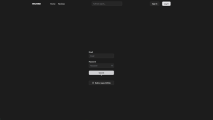
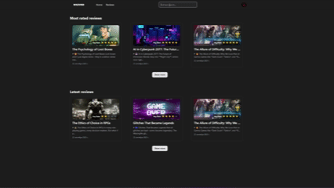

# 🗂 BlogApp-Ultra Backend

> **Русский:** Платформа для рецензий на фильмы, книги и мультфильмы с поддержкой markdown-разметки, комментариев, лайков и рейтингов. Встроенная админ-панель обеспечивает управление пользователями и контентом.

> **English:** A review platform for movies, books, and animations with markdown support, comments, likes, and ratings. The integrated admin panel enables full control over users and content.

---

## 🎬 Демонстрация функций / Project Demo

| GIF                                           | Описание / Description |
|-----------------------------------------------|------------------------|
|            | 🇷🇺 OAuth авторизация.    🇺🇸 OAuth authorization. |
|  | 🇷🇺 Основной обзор приложения: главная панель управления, страницы рецензий, комментариев и пользователей.   🇺🇸 Main overview of the app: dashboard, review pages, comments, and user management. |
|  | 🇷🇺 Создание комментариев и лайков с мгновенной синхронизацией через WebSocket.    🇺🇸 Adding comments and likes with real-time synchronization via WebSocket. |
|  | 🇷🇺 Управление рецензиями и пользователями: редактирование, сортировка и навигация по разделам.    🇺🇸 Managing reviews and users: editing, sorting, and navigating through sections. |
|  | 🇷🇺 Создание новой рецензии с поддержкой markdown и загрузки изображений.    🇺🇸 Creating a new review with markdown support and image upload. |

## 🔹 Полное описание / Full Description

🇷🇺 Русский:
Backend ReviewApp обеспечивает платформу для публикации рецензий на фильмы, книги и мультфильмы. Поддерживаются markdown-разметка, загрузка изображений, комментарии и система лайков. Реализована система рейтингов для рецензий и произведений. Админ-панель предоставляет управление пользователями, рецензиями и контентом. Поддерживается двухфакторная аутентификация, почтовые уведомления (регистрация, подтверждение аккаунта, восстановление пароля), контроль доступа и аналитика активности. Используется WebSocket для синхронизации комментариев и лайков в реальном времени.

🇺🇸 English:
ReviewApp backend powers a platform for publishing reviews of movies, books, and animations. It supports markdown formatting, image uploads, comments, and a like system. A rating system is implemented for both reviews and works. The admin panel enables user, review, and content management. Two-factor authentication, email notifications (registration, account confirmation, password recovery), access control, and activity analytics are included. Real-time synchronization of comments and likes is handled via WebSocket.
---

## 📌 Основные фичи / Features

🇷🇺 Русский:

🔑 Авторизация: стандартная, OAuth (GitHub) 
📝 Рецензии: создание, редактирование и удаление с поддержкой markdown-разметки 
🖼 Загрузка изображений: добавление картинок в рецензии и аватары пользователей 
💬 Комментарии: добавление, редактирование и удаление комментариев 
👍 Лайки: система лайков для рецензий и комментариев 
⭐ Рейтинги: оценки для рецензий и произведений 
🔄 WebSocket: синхронизация комментариев и лайков в реальном времени 
🔍 Полнотекстовый поиск (Elasticsearch): гибкий поиск по рецензиям, комментариям и произведениям. Даже при ошибках в запросе или опечатках система находит релевантные результаты 
🔁 Модуль ElasticSync: автоматическая синхронизация данных из PostgreSQL в Elasticsearch, с динамическим созданием индексов и маппингов 
🛡 Контроль доступа: роли администратора и пользователя 
⚙️ Админ-панель: управление пользователями, рецензиями и контентом 
🔒 Безопасность: каптча при регистрации/логине, защита сессий 
📜 Документация API через Swagger и JSDoc 

🇺🇸 English:

🔑 Authentication: standard, OAuth (Google/Yandex), two-factor, password reset  
📝 Reviews: create, edit, and delete with markdown support 
🖼 Image uploads: add images to reviews and user avatars 
💬 Comments: add, edit, and delete comments 
👍 Likes: like system for reviews and comments 
⭐ Ratings: scoring system for reviews and works 
🔄 WebSocket: real-time sync for comments and likes 
🔍 Full-text search (Elasticsearch): flexible search across reviews, comments, and works. Even with typos or mistakes, the system returns relevant results 
🔁 ElasticSync module: automatic synchronization of PostgreSQL data to Elasticsearch with dynamic index and mapping creation 
🛡 Access control: admin and user roles 
⚙️ Admin panel: manage users, reviews, and content 
🔒 Security: CAPTCHA on registration/login, secure session management 
📜 API documentation with Swagger and JSDoc 

---

## 🛠 Технологии / Technologies & Tools

| Компонент / Component          | Технология / Technology |
|--------------------------------|--------------------------|
| 🌐 Ядро / Core                  | NestJS                  |
| 🗄 База данных / Database       | PostgreSQL (TypeORM)    |
| ⚡ Кеширование / Cache          | Redis + ioredis         |
| 🔍 Поиск / Search               | Elasticsearch + ElasticSync |
| 🔑 Авторизация / Auth & Sessions| Passport (JWT, OAuth2), argon2 |
| 🔄 Реальное время / Real-time   | WebSocket (Socket.IO)   |
| 🛡 Безопасность / Security      | Helmet, Captcha, Rate limiting |
| 📝 Документация / Documentation | Swagger, JSDoc          |
| 📊 Логирование / Logging        | pino, pino-pretty, nestjs-pino |
| ⚙️ Дополнительно / Additional   | RxJS, class-validator, class-transformer, compression |
